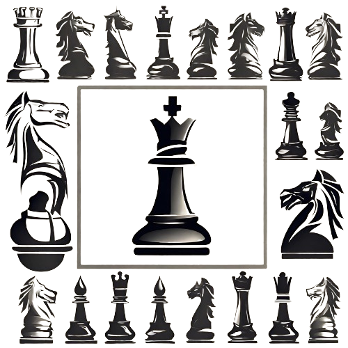

<p align="center">
  <a>
    
  </a>
</p>
<h1 align="center">Chess system</h1>
<p align="center">This is a chess system built in Java, designed to operate from the terminal. This project allows chess enthusiasts to play full games of chess directly from their computer's terminal.</p>

## Table of Contents

- [Topics Covered](#Topics-Covered)
  - OOP Topics
  - Data Structures Topics
- [Chess system design](#Chess-system-design)
- [How to Play](#How-to-Play)
  - Prerequisites
  - Select piece on the board
  - Compiling and running


# Topics Covered
Topics covered for project completion:
#### OOP Topics:
    -Encapsulation / Access Modifiers
    -Constructors
    -ToString (Object / overriding)
    -Enumerations
    -Inheritance
    -Downcasting
    -Static members
    -Layers pattern
    -Overriding
    -Overloading
    -Polymorphism
    -Exceptions
    -Abstract method / class
#### Data Structures Topics:
    -List    
    -Matrix
# Chess system design
<p align="center">
  <a>
    
  </a>
</p>

# How to Play 
### Prerequisites

Before getting started, you'll need to have the following tools installed on your machine:
[Java jdk](https://www.oracle.com/java/technologies/downloads/).
Additionally, it's recommended to have an editor to run the code such as [VSCode](https://code.visualstudio.com/) , and in VSCode, it's necessary to have the "Extension Pack for Java" extension installed to run the Java application.

### Select piece on the board

The game will feature the following table in which the player must 
select the combination of row and column to choose the piece and 
select the target. For example: a2 to choose column a and row 2.

8 R N B Q K B N R  
7 P P P P P P P P  
6 -- -- -- -- -- -- -- --  
5 -- -- -- -- -- -- -- --  
4 -- -- -- -- -- -- -- --  
3 -- -- -- -- -- -- -- --  
2 P P P P P P P P  
1 R N B Q K B N R  
--A B B D E F G H  


### ♟️ Compiling and running

```bash
# Clone this repository.
$ git clone <https://github.com/robertomatheuss/chess-system-java.git>

# Run the application from the Main file.
$ src/main/java/org/example/application/Main.java
